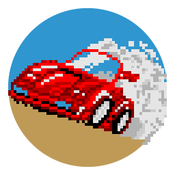

<h1 align="center">
  
   
  Cannonball
</h1>

<b>This is the snap for Cannonball</b>, <i>"An Enhanced OutRun Engine"</i>. It works on Ubuntu, Fedora, Debian, and other major Linux distributions.

Published for  with 💝

## Install

The snap includes the game engine only; when the game runs for the first time it will download the appropriate ROM files.

    sudo snap install cannonball
    sudo snap connect cannonball:joystick

## About

CannonBall is a program which allows you to play an enhanced version of Yu Suzuki's seminal arcade racer, OutRun. Cannonball is not an emulator; it is a complete rewrite of the original game into portable C++.

  * [Cannonball Manual](https://github.com/djyt/cannonball/wiki/Cannonball-Manual)
  * [Cannonball Wiki](https://github.com/djyt/cannonball/wiki)

### Enhancements

  * 60 fps gameplay (smoother than the original game)
  * True widescreen mode (extend the play area by 25%)
  * High Resolution mode (improves sprite scaling)
  * New Camera Views
  * Time Trial Mode (Beat your time on a chosen level)
  * Continuous Mode (Play all 15 stages sequentially)
  * Western, Japanese & Prototype Track Support
  * Support for Custom Tracks from LayOut
  * Customisable Music
  * Toggle Fixed Audio ROM
  * High Score Saving
  * Analog and Digital Controllers Supported
  * Automatic gear change
  * Cheats (No Traffic, Infinite Time)
  * Optional Attract Mode AI Improvements
  * More level objects

### Bug Fixes

Fixes for bugs present in the original game:

  * Erroneous shadow fix
  * Sprite zoom fix
  * Correct millisecond value shown on passing checkpoint
  * Steering bug
  * Misplaced tile on music selection screen fixed
